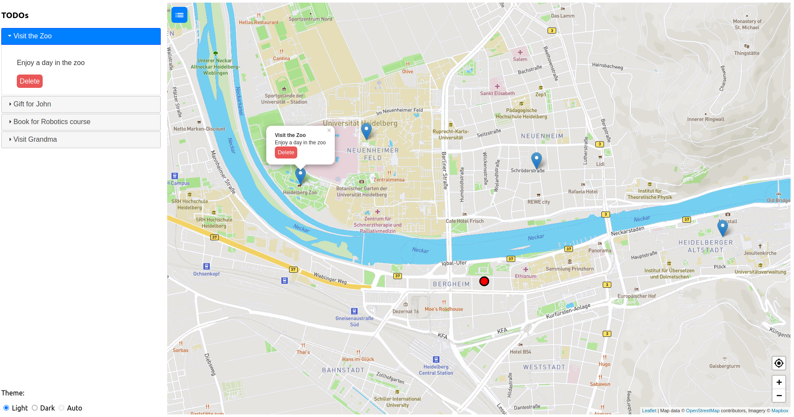

# Geo TODO
For this project the goal was to create a mobile website that makes use of device sensors such as GPS and ambient light sensor while also taking different
screen sizes into account and providing a reactive and context aware app.

## Functionality
- Add a location based TODO item by clicking a position on the map
- View TODO items on the map or a list view
- clicking an item on the map focuses the item in the list and vice versa
- The user's location is shown on the map
- A button lets the user jump back to his position
- The user can decide between a light and dark theme
- If the device provides an ambient light sensor the user can select Auto theming which will change between light and dark theme based on the users surrounding illuminance
- The list view can be hidden in order to give the map more screen presence (button on top left corner)
- The site adapts to different display sizes by defaulting to a hidden list view on smnall screens and a visible list view on a bigger screen

Light theme, big screen:

Dark theme, big screen:

Add a new item:

Smaller screen:

  
  

Phone portrait mode

  
  

Phone landscape mode

  
  

